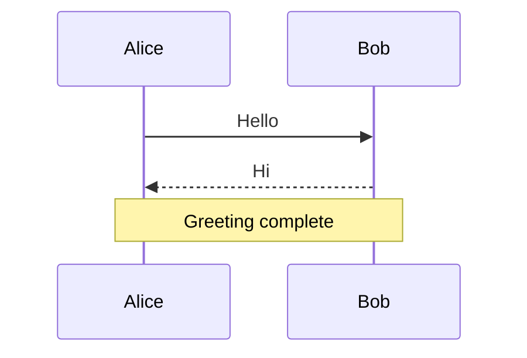
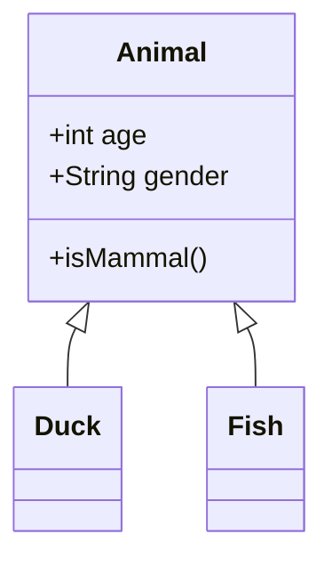
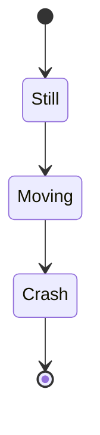
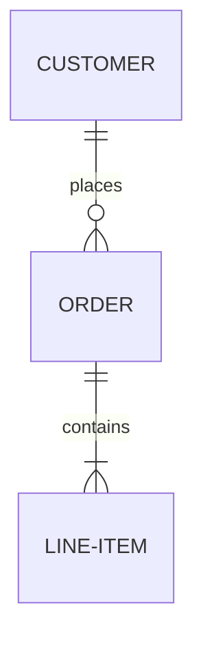
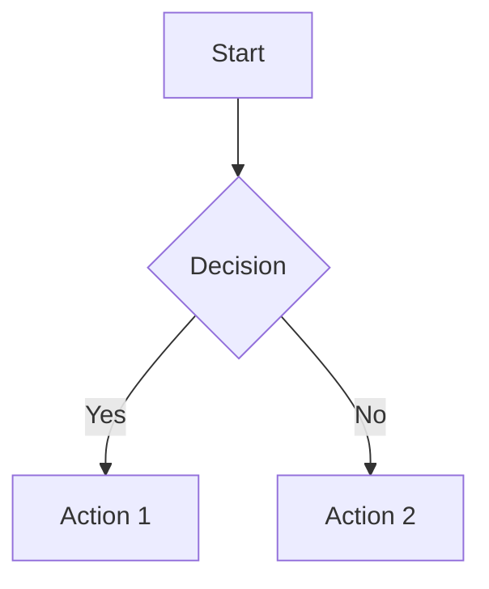

# Design Analyst Model - Improvement Context

## Current State (v4 - Production)

**Location:** `adapters/design-analyst-v4`
**Base Model:** microsoft/Phi-3-mini-4k-instruct
**Status:** Ready for demo, needs improvement

### Training Stats
- Final train loss: 0.402
- Final val loss: 0.417
- Test loss: 0.428
- Test perplexity: 1.535
- No overfitting ✅

### Capabilities
| Task | Status | Notes |
|------|--------|-------|
| sequenceDiagram | ✅ Works | 100% valid syntax |
| Project health analysis | ✅ Works | JSON output |
| classDiagram | ⚠️ Partial | ~33% valid, syntax errors |
| flowchart | ⚠️ Partial | ~66% valid |
| erDiagram | ❌ Broken | Mixing syntax types |
| stateDiagram | ❌ Broken | Wrong format |

### Test Results
```
Total tests:     13
Generated:       13/13 (100%)
Extracted:       13/13 (100%)
Valid syntax:    6/13 (46%)
```

---

## Root Cause Analysis

### Why Some Diagram Types Fail

1. **Training data quality** - Generated examples had syntax errors
2. **Insufficient examples** - Only 18 stateDiagram, 41 erDiagram vs 113 flowchart
3. **No validation** - Training data wasn't validated with `mmdc` before use

### Data Distribution (v4 training)
```
Project health: 1073
Mermaid diagrams: 252
  - flowchart: 113
  - sequenceDiagram: 71
  - classDiagram: 67
  - erDiagram: 41
  - stateDiagram: 18
Rust code: 45
```

---

## Improvement Plan

### Phase 1: Clean Training Data

1. **Validate existing data**
   ```bash
   # Script exists but incomplete
   python scripts/test_mermaid_output.py --validate-only
   ```

2. **Remove broken examples** from training set

3. **Add validated examples from official docs**
    - Source: https://mermaid.js.org/syntax/
    - Each diagram type has official examples
    - Validate each with `mmdc` before adding

### Phase 2: Generate More Data

**Key sources for high-quality examples:**

1. **Official Mermaid docs:**
    - https://mermaid.js.org/syntax/sequenceDiagram.html
    - https://mermaid.js.org/syntax/classDiagram.html
    - https://mermaid.js.org/syntax/stateDiagram.html
    - https://mermaid.js.org/syntax/entityRelationshipDiagram.html
    - https://mermaid.js.org/syntax/flowchart.html

2. **Template-based generation:**
    - Define valid syntax templates per diagram type
    - Fill in variations programmatically
    - Validate each generated example

3. **GitHub repos** with working Mermaid in READMEs

### Phase 3: Retrain

**Config that worked well (v4):**
```yaml
batch_size: 4
iters: 600
learning_rate: 1e-5
lora_parameters:
  keys: ["self_attn.q_proj", "self_attn.k_proj", "self_attn.v_proj", "self_attn.o_proj"]
  rank: 8
  alpha: 16
  dropout: 0.1
lr_schedule:
  name: cosine_decay
  warmup: 50
```

**Target data distribution:**
- 100+ examples per diagram type (balanced)
- All validated with `mmdc`
- Mix of simple and complex examples

---

## Files & Scripts

### Training
- `scripts/lora_config.yaml` - Training config (v4)
- `data/mlx_final/` - Current training data
- `adapters/design-analyst-v4/` - Current adapter weights

### Testing
- `scripts/test_mermaid_model.py` - Validates model output with mmdc
- Requires: `npm install -g @mermaid-js/mermaid-cli`

### Data Generation (TODO)
- `scripts/generate_mermaid_docs_data.py` - Started but incomplete
- Need to complete with official examples

---

## Correct Mermaid Syntax Reference

### sequenceDiagram (WORKS)


### classDiagram (NEEDS WORK)


### stateDiagram-v2 (BROKEN - use this syntax)


### erDiagram (BROKEN - use this syntax)


### flowchart (PARTIAL)


---

## Quick Commands

### Test current model
```bash
python scripts/test_mermaid_model.py --quick
```

### Generate and validate
```bash
python -m mlx_lm generate \
    --model microsoft/Phi-3-mini-4k-instruct \
    --adapter-path adapters/design-analyst-v4 \
    --max-tokens 500 \
    --prompt "Create a Mermaid sequenceDiagram for user login"
```

### Convert to GGUF
```bash
python -m mlx_lm.gguf --help  # Check exact command
```

### Train new version
```bash
python -m mlx_lm lora --config scripts/lora_config.yaml
```

---

## Next Steps (Priority Order)

1. [ ] Complete `generate_mermaid_docs_data.py` with official examples
2. [ ] Validate all existing training data, remove broken
3. [ ] Add 50+ validated examples per diagram type
4. [ ] Retrain as v5
5. [ ] Test and compare v4 vs v5

---

## Notes

- Model is good enough for demo (sequenceDiagram works, project health works)
- Focus improvement on classDiagram, erDiagram, stateDiagram
- Quality of data > quantity
- Always validate with `mmdc` before adding to training set